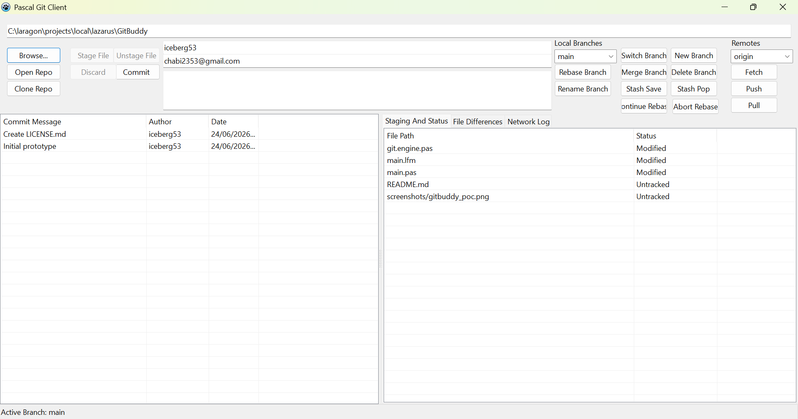

## About The Project

This is an early prototype of a Pascal Git GUI built using the Lazarus IDE.

It covers many Git operations already:

- Repository : Create, clone or open an exisiting one
- Branches : Create, switch, merge, delete, ...
- Remotes : fetch, pull and push
- Workspace : Staging, unstaging, discarding changes, diffs, etc ...

Of course, it's far from perfect and I still have a lot to do regarding the missing features, and the UI which is very basic right now and quite cluttered given that I started 
the project as an experiment after finding [libgit2-delphi](https://github.com/todaysoftware/libgit2-delphi) which allowed me to build more than a simple CLI wrapper. 

I relied a lot on the libgit2 examples and some AI assistance to figure things out and I need some time to really absorb everything.

If you're curious about a similar project, you might take a look. And your feedback would be really helpful as I'm still new to Free Pascal and Lazarus with less than a month of 
experience. This project was meant to help me get more familiar with the language and git internals and I hope you find it useful.

 ### Built With

- [Free Pascal](https://www.freepascal.org/)
- [Lazarus](https://www.lazarus-ide.org/)
- [Libgit2-delphi](https://github.com/todaysoftware/libgit2-delphi)

 ## Getting Started

The project is currently in its early phase and only supports Windows until I add the libgit library for other platforms. 

To get started, import it in Lazarus and run it.

 ## Roadmap

- [x] Basic repository and workspace management
- [x] Basic local and remote branches management
- [ ] Commit Graph
- [ ] UI redesign
- [ ] Tags, submodules management
- [ ] Advanced features
- [ ] Multi-language Support
  - [ ] French
  - [ ] ...

Feel free to open an issue if you have any ideas or if you face an issue with the project. I'll try my best to help.

 ## Contributing

Contributions are what make the open source community such an amazing place to learn, inspire, and create. Any contributions you make are **greatly appreciated**.

If you have a suggestion that would make this better, please fork the repo and create a pull request. You can also simply open an issue with the tag "enhancement".
Don't forget to give the project a star! Thanks again!

1. Fork the Project
2. Create your Feature Branch (`git checkout -b feature/AmazingFeature`)
3. Commit your Changes (`git commit -m 'Add some AmazingFeature'`)
4. Push to the Branch (`git push origin feature/AmazingFeature`)
5. Open a Pull Request

 ## License

Distributed under the MIT License. See [MIT License](https://opensource.org/licenses/MIT) for more information.
 ## Contact

Aiman CHABI - 
